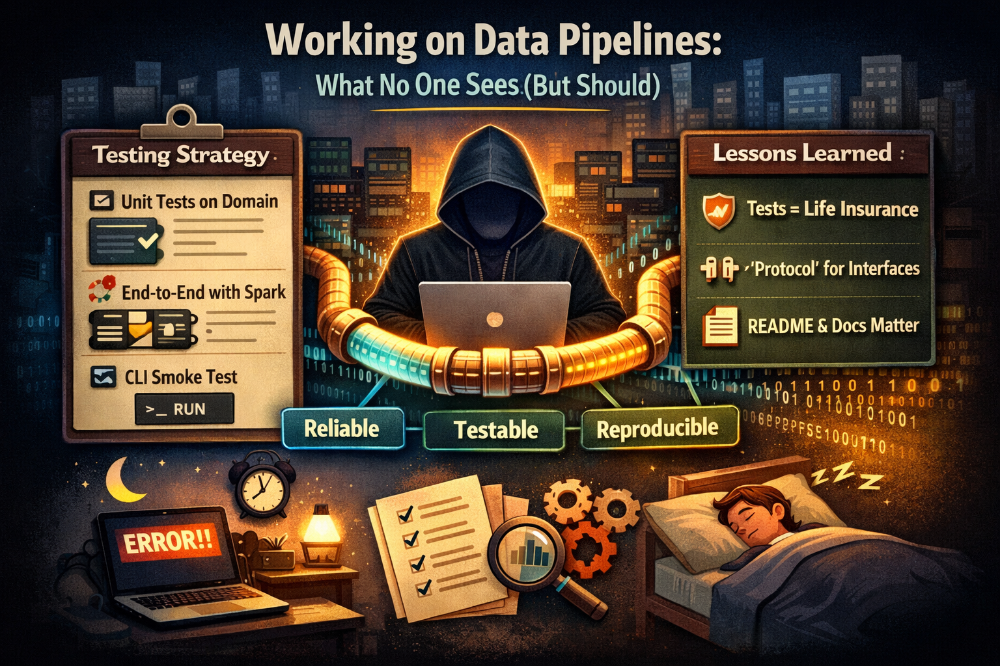

# ETL Treino – Spark-Based Data Pipeline



## Overview

ETL Treino is a small but production-oriented data pipeline written in Python and PySpark.  
It reads transactional data from CSV, validates and transforms it, and then writes the
result to different sinks (Parquet, Delta Lake or PostgreSQL) while optionally sending
execution metrics to MLflow.

The project is structured to demonstrate clean layering, testability, and environment-safe
configuration via `.env` files and CI automation.

---

## Architecture and Design

### High-Level Flow

1. **CLI entrypoint**: `presentation.cli.main` loads configuration and orchestrates the run.
2. **Spark session**: created by `adapters.spark.session.build_spark`.
3. **Reader**: `SparkCSVReader` loads raw transactions from CSV into a DataFrame.
4. **Transformer**: `TransactionTransformer` normalizes and enriches the data.
5. **Validator**: `TransactionValidator` enforces data quality constraints.
6. **Reporter**: one of `ParquetReporter`, `DeltaReporter` or `PostgresReporter` persists the data.
7. **Monitoring**: optionally `MflowMonitor` pushes metrics to MLflow.
8. **Pipeline**: `app.Pipeline` coordinates the previous components and produces metrics.

### Layered Modules

- **Domain**
  - [`src/domain/models.py`](file:///Users/diegogo/Documents/EngenhariaDados/ETLTreino/src/domain/models.py):
    - `Transaction`: Pydantic model representing a single transaction with strong validation on:
      - `product`, `currency`, `status` (Literal choices)
      - `amount` (must be positive)
      - `timestamp` (Python `datetime`)
  - Purpose: encode business rules and invariants independent of infrastructure.

- **Core Interfaces**
  - [`src/core/interfaces.py`](file:///Users/diegogo/Documents/EngenhariaDados/ETLTreino/src/core/interfaces.py):
    - `DataReader`, `Transformer`, `Validator`, `Reporter`, `HealthMonitor`.
  - Implemented as `Protocol` types to support dependency inversion and easy testing.

- **Adapters**
  - Readers:
    - [`SparkCSVReader`](file:///Users/diegogo/Documents/EngenhariaDados/ETLTreino/src/adapters/readers/spark_reader.py) – reads CSV using a provided `StructType` schema and returns a DataFrame.
  - Transformers:
    - [`TransactionTransformer`](file:///Users/diegogo/Documents/EngenhariaDados/ETLTreino/src/adapters/transformers/transactions.py):
      - Uppercases currency.
      - Adds `date` column from `timestamp`.
      - Adds `month` column from `timestamp`.
      - Filters only `"posted"` and `"pending"` statuses.
  - Validators:
    - [`TransactionValidator`](file:///Users/diegogo/Documents/EngenhariaDados/ETLTreino/src/adapters/validators/transactions.py):
      - Checks for `NULL` in mandatory columns.
      - Ensures `amount > 0`.
      - Checks categorical values against whitelists for product, currency and status.
  - Reporters:
    - [`ParquetReporter`](file:///Users/diegogo/Documents/EngenhariaDados/ETLTreino/src/adapters/reporters/parquet_reporter.py) – writes DataFrame to Parquet.
    - [`DeltaReporter`](file:///Users/diegogo/Documents/EngenhariaDados/ETLTreino/src/adapters/reporters/delta_reporter.py) – writes to Delta Lake.
    - [`PostgresReporter`](file:///Users/diegogo/Documents/EngenhariaDados/ETLTreino/src/adapters/reporters/postgres_reporter.py) – writes to PostgreSQL via JDBC, reading credentials from `.env`.
  - Spark session:
    - [`build_spark`](file:///Users/diegogo/Documents/EngenhariaDados/ETLTreino/src/adapters/spark/session.py):
      - Configures master, shuffle partitions, Arrow, and optionally:
        - PostgreSQL JDBC driver (`PG_JDBC=true`).
        - Delta Spark extensions and packages (`DELTA_ENABLED=true`).
  - Monitoring:
    - [`MflowMonitor`](file:///Users/diegogo/Documents/EngenhariaDados/ETLTreino/src/adapters/monitoring/mlflow_monitor.py):
      - If `mlflow` is installed and enabled, logs pipeline metrics using experiments and runs.

- **Application Layer**
  - [`Pipeline`](file:///Users/diegogo/Documents/EngenhariaDados/ETLTreino/src/app/pipeline.py):
    - Orchestrates:
      - `reader.read()`
      - `transformer.transform()`
      - `validator.validate()`
      - `reporter.write()`
      - Optional `monitor.report_metrics()`
    - Measures timing with `perf_counter` and returns a metrics mapping.

- **Bootstrap / Configuration**
  - [`config/pipeline.yml`](file:///Users/diegogo/Documents/EngenhariaDados/ETLTreino/config/pipeline.yml):
    - Defines `input_path`, `output_dir`, output type (parquet/postgres/delta) and MLflow settings.
  - [`bootstrap.factories.make_reporter`](file:///Users/diegogo/Documents/EngenhariaDados/ETLTreino/src/bootstrap/factories.py):
    - Chooses reporter implementation based on configuration.
  - [`scripts/init_postgres.py`](file:///Users/diegogo/Documents/EngenhariaDados/ETLTreino/scripts/init_postgres.py):
    - Ensures PostgreSQL database and table exist, using credentials from `.env`.

- **Presentation / CLI**
  - [`presentation.cli`](file:///Users/diegogo/Documents/EngenhariaDados/ETLTreino/src/presentation/cli.py):
    - Loads `.env`.
    - Loads YAML config and environment variables.
    - Builds Spark session and schema.
    - Wires the `Pipeline` and runs it, printing metrics.

### Design Patterns and Practices

- **Hexagonal / Ports-and-Adapters style**
  - Core logic (Pipeline + interfaces) is decoupled from Spark, files, database, or MLflow.
- **Dependency Inversion via Protocols**
  - Adapters implement `DataReader`, `Transformer`, `Validator`, `Reporter`, `HealthMonitor`.
- **Configuration via environment + YAML**
  - Sensitive values only live in `.env` (not in code).
- **Testability**
  - Spark-dependent parts are tested with fixtures and small datasets.

---

## System Requirements and Dependencies

- Python: `3.11` (see [`.python-version`](file:///Users/diegogo/Documents/EngenhariaDados/ETLTreino/.python-version))
- Core libraries:
  - PySpark `3.5.3`
  - PyArrow
  - Pydantic `v2`
  - python-dotenv
  - pytest + pytest-cov
  - delta-spark `3.3.0`
  - psycopg / psycopg-binary
  - mkdocs, mkdocs-material (for documentation site, if used)
- Package manager and virtualenv:
  - [`uv`](https://github.com/astral-sh/uv) is used both locally and in CI.

All Python dependencies are listed in
[`requirements.txt`](file:///Users/diegogo/Documents/EngenhariaDados/ETLTreino/requirements.txt).

---

## Installation and Setup

### 1. Clone the Repository

```bash
git clone <your-repo-url>.git
cd ETLTreino
```

### 2. Create Virtual Environment with uv

```bash
uv venv .venvETLTreino
source .venvETLTreino/bin/activate
```

### 3. Install Dependencies

```bash
uv pip install -p .venvETLTreino/bin/python -r requirements.txt
```

---

## Configuration

Configuration is split into **environment variables** and a **YAML file**.

### Environment Variables (.env)

Sensitive and environment-specific values live in `config/.env`, which is git-ignored.
Use [`config/.env.example`](file:///Users/diegogo/Documents/EngenhariaDados/ETLTreino/config/.env.example)
as a template:

```env
# Database configuration
PG_DB=example_db
PG_ADMIN_DB=postgres
PG_HOST=localhost
PG_PORT=5432
PG_URL=jdbc:postgresql://localhost:5432/example_db
PG_USER=example_user
PG_PASSWORD=example_password
PG_DRIVER=org.postgresql.Driver

# Spark and Delta configuration
PG_JDBC=false
DELTA_ENABLED=false

# JWT and security
JWT_SECRET=change_this_jwt_secret

# External services
EXTERNAL_API_URL=https://api.example.com
EXTERNAL_API_KEY=example_api_key

# Application settings
APP_ENV=development
LOG_LEVEL=INFO
```

Create your real config:

```bash
cp config/.env.example config/.env
# Edit config/.env with real values
```

### Pipeline YAML

[`config/pipeline.yml`](file:///Users/diegogo/Documents/EngenhariaDados/ETLTreino/config/pipeline.yml):

```yaml
input_path: ./tests/fixtures/transactions.csv
output_dir: ./dist/output_parquet
output:
  type: parquet        # parquet | postgres | delta
  path: ./dist/output_parquet
mlflow:
  enabled: false
  experiment: idea
```

Environment variables can override some of these defaults (for example `DATA_SOURCE_PATH`,
`OUTPUT_DIR`, `MLFLOW_ENABLED`, `CONFIG_PATH`).

---

## Running the Pipeline

### CLI Execution

From the project root, with the virtualenv activated:

```bash
DATA_SOURCE_PATH=tests/fixtures/transactions.csv \
OUTPUT_DIR=./dist/output_parquet \
PYTHONPATH=./src \
.venvETLTreino/bin/python -m presentation.cli
```

The CLI will:

- Load the configuration.
- Build the Spark session and schema.
- Execute the pipeline.
- Print metrics on stdout.

### Using the Core Pipeline in Code

Example of using `Pipeline` directly for custom wiring:

```python
from pyspark.sql.types import StructType, StructField, StringType, DoubleType, TimestampType
from app import Pipeline
from adapters.spark.session import build_spark
from adapters.readers import SparkCSVReader
from adapters.transformers import TransactionTransformer
from adapters.validators import TransactionValidator
from adapters.reporters import ParquetReporter


def run_custom_pipeline():
    # Build Spark session
    spark = build_spark(app_name="CustomPipeline")

    # Define schema for CSV input
    schema = StructType(
        [
            StructField("id", StringType(), False),
            StructField("product", StringType(), False),
            StructField("amount", DoubleType(), False),
            StructField("currency", StringType(), False),
            StructField("timestamp", TimestampType(), False),
            StructField("status", StringType(), False),
        ]
    )

    reader = SparkCSVReader(spark, "path/to/transactions.csv", schema)
    transformer = TransactionTransformer()
    validator = TransactionValidator()
    reporter = ParquetReporter("./dist/custom_output")

    pipeline = Pipeline(reader=reader, transformer=transformer, validator=validator, reporter=reporter)
    metrics = pipeline.run()
    return metrics
```

---

## Database Schema

For PostgreSQL output, the pipeline relies on the following table schema
([`sql/create_tables.sql`](file:///Users/diegogo/Documents/EngenhariaDados/ETLTreino/sql/create_tables.sql)):

```sql
CREATE TABLE IF NOT EXISTS public.transformed_transactions (
    id TEXT NOT NULL,
    product TEXT NOT NULL,
    amount DOUBLE PRECISION NOT NULL,
    currency TEXT NOT NULL,
    timestamp TIMESTAMP NOT NULL,
    status TEXT NOT NULL,
    date DATE,
    month INTEGER
);
```

The script [`scripts/init_postgres.py`](file:///Users/diegogo/Documents/EngenhariaDados/ETLTreino/scripts/init_postgres.py)
can create both the database and the table, using environment variables from `config/.env`.

---

## Security Considerations

- **Secrets in `.env` only**
  - Database URLs, usernames, passwords, JWT secrets and API keys are never hard-coded.
  - `.env` files are git-ignored by default.
- **Minimal defaults in code**
  - Adapters such as `PostgresReporter` require mandatory environment variables and raise
    clear errors if they are missing.
- **Spark JDBC drivers**
  - JDBC driver coordinates are configured via environment flags (`PG_JDBC`, `DELTA_ENABLED`),
    preventing accidental inclusion when not needed.

When deploying to shared environments (CI/CD, staging, production), configure credentials
via the platform's secret management rather than committing them to this repository.

---

## Performance Considerations

While this project is intentionally small, a few performance-related choices are present:

- `spark.sql.shuffle.partitions` is set to low values (2 or 4) for local development to
  reduce overhead.
- Arrow execution is enabled to speed up PySpark operations where applicable.
- The `Pipeline` collects simple aggregated metrics instead of materializing large amounts
  of data on the driver.

For larger datasets or production scenarios you should:

- Tune `spark.sql.shuffle.partitions` according to cluster size and data volume.
- Consider partitioning and bucketing strategies for Parquet and Delta outputs.

---

## Testing

The project uses `pytest` with `pytest-cov`. Tests cover:

- The domain model (`Transaction`) and its validation rules.
- The `Pipeline` end-to-end with a small Spark session.
- CLI smoke test to ensure wiring and configuration work together.

### Run Tests (local)

Inside the virtualenv:

```bash
PYTHONPATH=./src pytest
```

Or explicitly using the venv Python:

```bash
PYTHONPATH=./src .venvETLTreino/bin/pytest -q
```

### Coverage in CI

GitHub Actions run tests on every push and pull request using:

- `uv venv .venvETLTreino`
- `uv pip install -p .venvETLTreino/bin/python -r requirements.txt`
- `.venvETLTreino/bin/pytest -q`

You can optionally enable `pytest-cov` locally by adding `--cov` flags to the pytest call.

---

## Deployment

This repository does not enforce a specific deployment platform, but a typical pattern is:

1. Build a Docker image that:
   - Uses Python 3.11.
   - Installs `requirements.txt`.
   - Copies the `src`, `config`, and `sql` directories.
   - Marks `presentation.cli` as the entrypoint.
2. Provide a `.env` file (or environment variables) at runtime for:
   - Database access.
   - Output directory or object storage path.
   - MLflow host and experiment name if using monitoring.
3. Schedule the container as a job (cron, Airflow, Argo, etc.).

The `scripts/init_postgres.py` helper can be executed as an init step to prepare the
database before the main pipeline runs.

---

## Contribution Guidelines

1. **Branching**
   - Create feature branches from `develop` (or your main integration branch).
2. **Environment**
   - Always work inside `.venvETLTreino` created with `uv venv`.
3. **Code Style**
   - Follow existing patterns for adapters, interfaces and configuration.
   - Prefer small, focused functions and keep business logic out of the CLI.
4. **Tests**
   - Add or update tests for any new behavior under `tests/`.
   - Ensure `PYTHONPATH=./src pytest` passes before opening a PR.
5. **Security**
   - Never commit `.env` or real secrets.
   - Use `.env.example` for documenting required keys.

---

## License

This project is licensed under the **MIT License**:

Permission is hereby granted, free of charge, to any person obtaining a copy
of this software and associated documentation files (the "Software"), to deal
in the Software without restriction, including without limitation the rights
to use, copy, modify, merge, publish, distribute, sublicense, and/or sell
copies of the Software, and to permit persons to whom the Software is
furnished to do so, subject to the following conditions:

The above copyright notice and this permission notice shall be included in all
copies or substantial portions of the Software.

THE SOFTWARE IS PROVIDED "AS IS", WITHOUT WARRANTY OF ANY KIND, EXPRESS OR
IMPLIED, INCLUDING BUT NOT LIMITED TO THE WARRANTIES OF MERCHANTABILITY,
FITNESS FOR A PARTICULAR PURPOSE AND NONINFRINGEMENT. IN NO EVENT SHALL THE
AUTHORS OR COPYRIGHT HOLDERS BE LIABLE FOR ANY CLAIM, DAMAGES OR OTHER
LIABILITY, WHETHER IN AN ACTION OF CONTRACT, TORT OR OTHERWISE, ARISING FROM,
OUT OF OR IN CONNECTION WITH THE SOFTWARE OR THE USE OR OTHER DEALINGS IN THE
SOFTWARE.

---

## Contact and Support

For questions, issues or feature requests:

Sorry !!
But if pay may be I can back here.
